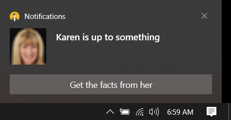
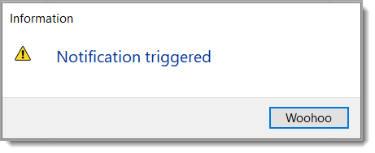
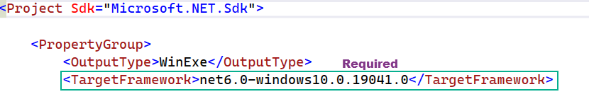

# About

What is a toast notification in Windows 10?
Send a local toast notification from a C# app - Windows apps ...
A toast notification is a message that your app can construct and deliver to your user while they are not currently inside your app. 

A very simple example for `toast notifications` where it is configured to clear the event to capture user actions when the application is closed, to change this behavior comment out the code in form closing event.

Notes 
- Dialogs class has a method for showing information with more options that MessageBox.Show, see the following repository for a [library](https://github.com/karenpayneoregon/task-dialog-library) and the following for more indepth code [samples](https://github.com/karenpayneoregon/task-dialog-csharp) which includes WPF.
- The following event `OnActived` runs in a different thread than the calling code so we must use `Invoke` to prevent cross-threading.

```csharp
private void OnShown(object sender, EventArgs e)
{
           
    ToastNotificationManagerCompat.OnActivated += toastArgs =>
    {
        ToastArguments args = ToastArguments.Parse(toastArgs.Argument);

        if (args.Contains("conversationId"))
        {
            if (args["conversationId"] == "9814")
            {
                        
                Invoke(delegate
                {
                    Dialogs.Information(ExecuteButton,"Notification triggered", "Woohoo");
                });
            }
        }

    };
}
```

Notification presented.



Dialog from `OnShown` above



# Required

In the project file

